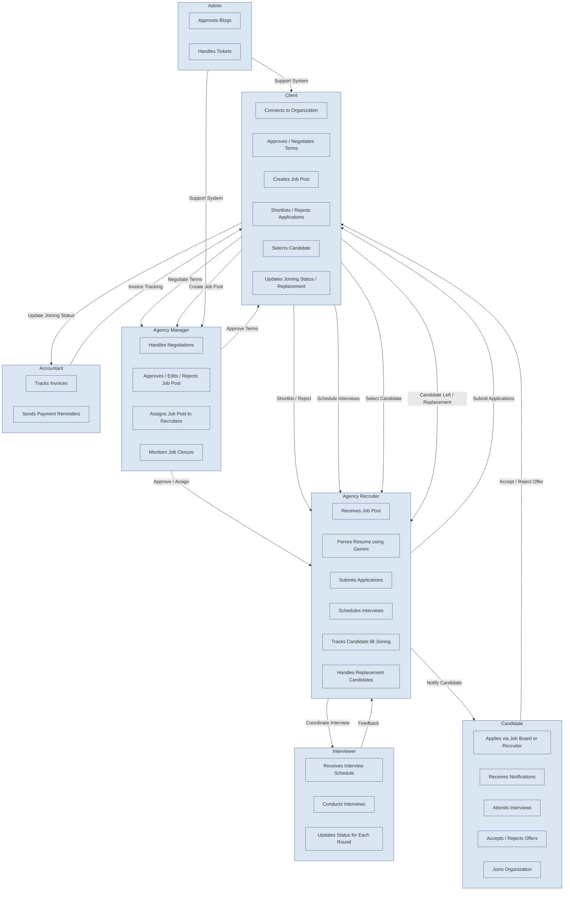

### GA Hiresync – Complete Application Flow

---

#### Roles and Their Functionalities

##### 1. **Agency Manager**
- **Responsibilities:**
  - Connects with clients and manages organization-level tasks.
  - Approves, edits, or rejects job posts created by clients.
  - Assigns approved job posts to recruiters based on location.
  - Tracks recruiter performance and ensures jobs are filled.
  - Handles terms negotiation requests from clients.
  - Oversees overall hiring pipeline and closing of job posts.

---

##### 2. **Agency Recruiters**
- **Responsibilities:**
  - Receives assigned job posts and job locations from the Agency Manager.
  - Uses tools like **Gemini API** for parsing resumes and finding matching candidates.
  - Submits applications for job posts and locations.
  - Schedules interviews between candidates and interviewers.
  - Tracks the candidate's status from processing to joining.
  - Manages replacements when candidates leave.

---

##### 3. **Client**
- **Responsibilities:**
  - Connects with the organization using a unique organization code.
  - Reviews and approves or negotiates **terms and conditions**.
  - Creates job posts after approval of terms.
  - Reviews applications submitted by recruiters:
    - Shortlist, reject, or hold applications.
    - Select candidates, negotiate or finalize offers.
  - Updates joining status and reports candidate exits (for replacement eligibility).

---

##### 4. **Interviewer**
- **Responsibilities:**
  - Receives scheduled interview notifications.
  - Conducts interviews and updates interview status (next round or rejection).
  - Provides feedback for each interview round.

---

##### 5. **Candidate**
- **Responsibilities:**
  - Applies through the GA Hiresync job board or is added by recruiters.
  - Receives notifications about shortlist status, interviews, and offers.
  - Can accept, reject, or negotiate joining offers.
  - Tracks application status through the candidate portal.

---

##### 6. **Accountant**
- **Responsibilities:**
  - Monitors invoices automatically generated when candidates join.
  - Alerts clients for pending payments.
  - Ensures financial tracking between client and organization.

---

##### 7. **Admin**
- **Responsibilities:**
  - Handles global platform activities.
  - Manages blog approvals and ticket resolutions.
  - Oversees non-role-specific administrative functions.

---

#### **End-to-End Application Flow**

##### **Step 1 – Client and Organization Setup**
- Client connects to the organization.
- Organization defines **terms and conditions** (CTC ranges, clauses).
- Client approves or negotiates terms (Agency Manager handles negotiations).
- If approved → client proceeds to job post creation.

##### **Step 2 – Job Post Creation and Approval**
- Client creates job post with:
  - Job details  
  - Skills  
  - Interview requirements  
- Agency Manager:
  - Approves → Moves to recruiters.
  - Edits → Sends back to client for confirmation.
  - Rejects → Stops the process.

##### **Step 3 – Recruiter Actions**
- Manager assigns job posts to recruiters (by location).
- Recruiters parse resumes (Gemini API) and submit applications.
- Candidates can also directly apply via job board.

##### **Step 4 – Application Shortlisting**
- Applications have statuses:
  - **Pending**, **Processing**, **Rejected**, **Hold**, **Selected**, **Accepted**, **Joined**, **Replacement**.
- Client reviews applications:
  - Shortlist → Moves to **Processing**.
  - Reject → Status set to **Rejected** (with reason).
- Notifications sent to recruiter and candidate on every status change.

##### **Step 5 – Interview Process**
- Recruiter schedules interview with interviewer and candidate.
- Interview rounds conducted.
- Interviewer updates feedback and round results.
- Application stays **Processing** until rounds are completed.
- Post-interview → Application moves to **Hold**.

##### **Step 6 – Final Selection and Joining**
- Client selects candidate → **Selected** status.
- Candidate responds:
  - Accepts → **Accepted** status.
  - Rejects / Negotiates → Agency Manager/Client approves or declines negotiation.
- On joining date:
  - Client updates status → **Joined**.
  - Position closes automatically.
- Accountant monitors invoice generation.

##### **Step 7 – Replacement Flow**
- If candidate leaves:
  - Client updates reason.
  - Eligibility for replacement checked.
  - If eligible → Job post reopens.
  - Recruiter finds replacement until filled.

---

### **Mermaid Diagram – Complete Flow**

