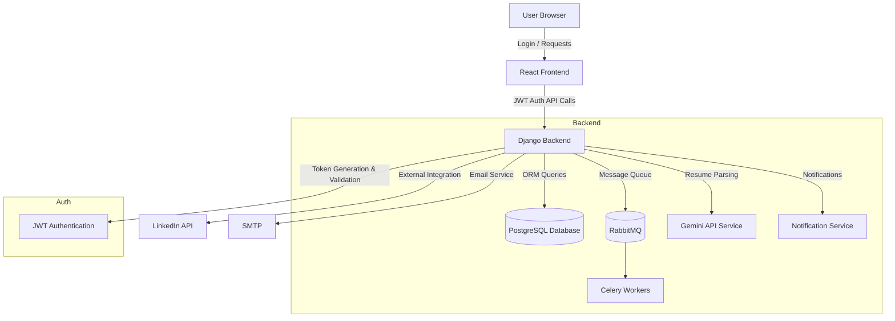

#### Flow of JobPost

- Intially Client connects to the organization to create a job opening.
- Organization while accepting the client, it needs to fill the terms and conditions for the ctc_range upto 1-100 LPA and sends notification to the client.
- Client to create the job post, it needs to approve the terms and conditions, or there is an option to negotiate the terms (client needs to fill the ctc_range and remaining terms) Notification sent to the manager automatically, and daily the notification will trigger to the agency manager until manager take an action on the job post.
- After approving the negotiation request, client can create the job post. if rejecets, unable to create the job post with that terms. 
- Client creates the job post which includes
  - Job details
  - Skill details
  - Interview details
- Agency can approve/edit/reject the job post. Automatic notifications for every action. 
  - For reject agency manager needs to give the reason.
  - For edit request, request sent to client with edited fields.client needs to approve the edit request/add new edit fields. then again sent to agency, now agency can approve or reject the job post. no edit module again.
- If agency accepts the job post, agency needs to assign the job post to the recruiter based on the location. Agency can assign multiple recruiters to single location and single job post. 
- Recruiter can send the applications based on the locations.
  - *there is so much flow of the applications, we can view the seperate chart for only application*
    
- After filling the positions of the job_post -> location, the status of the location is closed automatically. If all the locations are closed then the job post is closed. The status of the processing applications are closed.
- If any candidate left , then based on the reason the replacement will be given to the client.  If replacement is eligible and client wants replacement then job post again reopens.
- Client can select from the old applications or ask new applicatios to the organization.