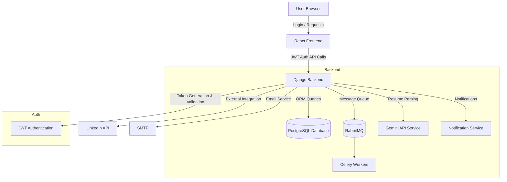

```mermaid

flowchart TB
    User[User Browser] -->|Login / Requests| ReactFrontend[React Frontend]
    ReactFrontend -->|JWT Auth API Calls| DjangoBackend[Django Backend]

    subgraph Backend
        DjangoBackend -->|ORM Queries| PostgreSQL[(PostgreSQL Database)]
        DjangoBackend -->|Message Queue| RabbitMQ[(RabbitMQ)]
        DjangoBackend -->|Resume Parsing| GeminiAI[Gemini API Service]
        DjangoBackend -->|Notifications| NotificationService[Notification Service]
        RabbitMQ --> CeleryWorkers[Celery Workers]
    end

    subgraph Auth
        DjangoBackend -->|Token Generation & Validation| JWT[JWT Authentication]
    end

    DjangoBackend -->|External Integration| LinkedInAPI[LinkedIn API]
    DjangoBackend -->|Email Service| SMTP

```

