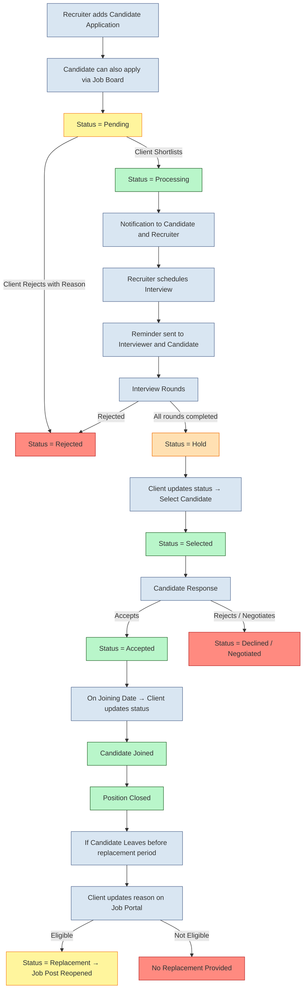

### Job Application Flow for GA Hiresync

---

#### **Job Application Status**

- 🟡 **Pending** → When the application is initially submitted or awaiting client action.
- 🟢 **Processing** → After client shortlists the application and interview process starts.
- 🔴 **Rejected** → When the client or recruiter rejects the application with a reason.
- 🟠 **Hold** → After interview rounds are completed and waiting for client final selection.
- ✅ **Selected** → When the client selects a candidate and provides CTC + joining date.
- 🔵 **Pending Joining** → When the candidate hasn't yet accepted or rejected the offer.
- 🟢 **Accepted** → When the candidate accepts the joining offer.
- 🔴 **Declined / Negotiated** → When the candidate rejects or negotiates the offer.
- ⚪ **Joined** → When the candidate successfully joins the organization.
- 🔴 **Left** → When the candidate leaves the organization.
- 🟡 **Replacement** → When a replacement process starts after a candidate leaves.

---

#### **Flow**

1. Recruiter adds candidate profiles/applications for allotted job post and location.  
2. Candidates can also apply through the GA Hiresync job board.  
3. **Status = Pending** until the client shortlists or rejects the application.  
4. Client actions:  
   - **Shortlist** → Status changes to **Processing**.  
   - **Reject** → Status changes to **Rejected** with a reason.  
5. After shortlisting:  
   - Notification sent to candidate and recruiter.  
   - Candidate account created automatically (if not exists).  
   - Recruiter notified to schedule an interview.  
6. Recruiter schedules interview → Reminder sent to interviewer and candidate.  
7. Interviewer updates interview status (Next round / Reject).  
   - Recruiter can also reject at any round → **Rejected**.  
8. Status remains **Processing** until all interview rounds are completed.  
9. After interview completion:  
   - Notification sent to recruiter and client.  
   - Status changes to **Hold**.  
10. Client updates status:  
    - **Selects candidate** → Status changes to **Selected**.  
    - Inputs agreed CTC + joining date.  
11. Candidate response:  
    - **Accepts** → Status = **Accepted**.  
    - **Rejects or Negotiates** → Status = **Declined / Negotiated**.  
12. On the joining date, client updates:  
    - Candidate **Joined** → Position closed.  
13. If candidate **Leaves** before replacement clause:  
    - Client updates job portal with reason.  
    - If eligible for replacement → **Replacement** process starts.  
    - Job post reopens (if closed) and continues until filled.  

---

#### Flowchart

