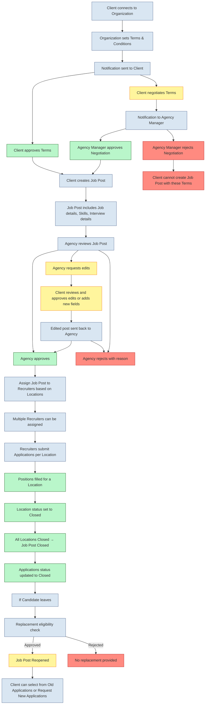

### Flow of Job Post

1. **Client Connection**
   - Initially, the client connects to the organization to create a job opening.

2. **Terms and Conditions**
   - When the organization accepts the client, it needs to fill out the **terms and conditions** for the CTC range (up to 1–100 LPA).
   - A notification is automatically sent to the client for review.

3. **Client Approval or Negotiation**
   - To create a job post, the client must approve the terms and conditions.
   - Alternatively, the client can **negotiate** the terms:
     - Client fills out the **CTC range** and remaining terms.
     - Notification is automatically sent to the agency manager.
     - Daily notifications continue until the agency manager takes action.
   - **Negotiation Outcome:**
     - If approved → client can proceed with creating the job post.
     - If rejected → client cannot create the job post with those terms.

4. **Job Post Creation**
   - Client creates the job post including:
     - **Job details**
     - **Skill details**
     - **Interview details**

5. **Agency Actions on Job Post**
   - Agency can:
     - **Approve** – job post moves forward.
     - **Edit** – edit request is sent back to the client:
       - Client reviews and approves edits or adds new fields.
       - Edited post returns to agency for final approval/rejection.
       - (No multiple edit cycles after this round.)
     - **Reject** – agency must provide a reason.
   - Automatic notifications are triggered for every action.

6. **Assigning Job Post**
   - If approved, the agency manager assigns the job post to recruiters **based on locations**.
   - Multiple recruiters can be assigned to:
     - A single location, or
     - A single job post.

7. **Application Submission**
   - Recruiters submit applications for specific job locations.
   - *(Application flow has its own detailed chart for clarity.)*

8. **Closing Job Locations and Posts**
   - Once all positions for a specific location are filled:
     - The **location status** is automatically marked as **closed**.
   - When all locations of a job post are closed:
     - The **job post status** is automatically **closed**.
   - Status of ongoing applications is updated to **closed** accordingly.

9. **Candidate Replacement**
   - If a selected candidate leaves:
     - Replacement is provided to the client based on eligibility and reason.
     - If replacement is approved:
       - Job post is **reopened**.
     - Client can:
       - Select from **previous applications**, or
       - Request **new applications** from the organization.

#### Go through this flowchart in mermade editor for visual representation.
