```mermaid
erDiagram
    USER ||--|| USER_PROFILE : has
    ORGANIZATION ||--|| USER : managed_by
    ORGANIZATION ||--o{ USER : has_recruiters
    CLIENT_DETAILS ||--|| USER : is_user
    CLIENT_ORGANIZATIONS ||--o{ CLIENT_DETAILS : includes_client
    CLIENT_ORGANIZATIONS ||--o{ ORGANIZATION : includes_org
    CLIENT_ORGANIZATION_TERMS ||--o{ CLIENT_ORGANIZATIONS : has_terms
    JOB_POSTINGS ||--|| ORGANIZATION : belongs_to
    JOB_POSTINGS ||--|| USER : created_by
    JOB_POSTINGS ||--o{ JOB_LOCATIONS : has
    JOB_LOCATIONS ||--o{ JOB_APPLICATIONS : contains
    ASSIGNED_JOBS ||--|| JOB_LOCATIONS : assigned_for
    ASSIGNED_JOBS ||--o{ USER : recruiters
    SKILL_METRICS_MODEL ||--|| JOB_POSTINGS : skill_for
    INTERVIEWER_DETAILS ||--|| JOB_POSTINGS : interviewer_for
    INTERVIEWER_DETAILS ||--|| USER : interviewer
    JOBPOST_TERMS ||--|| JOB_POSTINGS : job_terms
    CANDIDATE_RESUME ||--o{ CANDIDATE_SKILLSET : has
    JOB_APPLICATIONS ||--|| JOB_LOCATIONS : applies_to
    JOB_APPLICATIONS ||--|| USER : applicant
    JOB_APPLICATIONS ||--|| CANDIDATE_RESUME : resume_used
    INTERVIEWS_SCHEDULED ||--|| CANDIDATE_RESUME : candidate
    INTERVIEWS_SCHEDULED ||--|| USER : recruiter
    INTERVIEWS_SCHEDULED ||--|| USER : interviewer
    CANDIDATE_PROFILE ||--|| USER : profile_of
    CANDIDATE_EVALUATION ||--|| JOB_APPLICATIONS : evaluation_for
    CANDIDATE_EVALUATION ||--|| JOB_LOCATIONS : related_location
    CANDIDATE_EVALUATION ||--|| INTERVIEWS_SCHEDULED : related_interview
    SELECTED_CANDIDATE ||--|| JOB_APPLICATIONS : selected_from
    SELECTED_CANDIDATE ||--|| CANDIDATE_RESUME : candidate
    INVOICE_GENERATED ||--|| SELECTED_CANDIDATE : for_candidate
    INVOICE_GENERATED ||--|| ORGANIZATION : raised_by
    INVOICE_GENERATED ||--|| CLIENT_DETAILS : sent_to
    INVOICE_GENERATED ||--|| CLIENT_ORGANIZATION_TERMS : under_terms
    ORGANIZATION ||--o{ ACCOUNTANT : has
    ACCOUNTANT ||--|| USER : is_user
    JOB_APPLICATIONS ||--o{ REPLACEMENT_CANDIDATES : has_replacements
    USER ||--o{ TICKETS : raises
    TICKETS ||--o{ MESSAGES : has_messages
    USER ||--o{ BLOG_POSTS : creates
    USER ||--o{ NOTIFICATIONS : receives
    ORGANIZATION ||--|| LINKEDIN_INTEGRATIONS : has_integration
    FEATURES ||--o{ PLANFEATURE : feature_limits
    PLAN ||--o{ PLANFEATURE : includes_feature
    PLAN ||--o{ ORGANIZATION_PLAN : selected_by_org
    ORGANIZATION ||--o{ ORGANIZATION_PLAN : chooses_plan
    ORGANIZATION ||--o{ PLAN_HISTORY : has_history
    USER ||--o{ PLAN_HISTORY : selected_by
   F

    USER {
        int id PK
        string username
        string email 
        string role
        media profile
        boolean is_verified
    }
    USER_PROFILE {
        int id PK
        int user_id FK
        string first_name
        string last_name
    }
    ORGANIZATION {
        int id PK
        string name
        string org_code
        int manager_id FK
    }
    CLIENT_DETAILS {
        int id PK
        string username
        int user_id FK
        string client_organization_details
    }
    CLIENT_ORGANIZATIONS {
        int id PK
        int client_id FK
        int organization_id FK
        boolean approval_status
    }
    CLIENT_ORGANIZATION_TERMS {
        int id PK
        int client_organization_id FK
        string ctc_range
        string all_terms
        boolean is_negotiated 
    }
    JOB_POSTINGS {
        int id PK
        int user_id FK
        int organization_id FK
        string title
        string remaining_fields
    }
    JOB_LOCATIONS {
        int id PK
        int job_posting_id FK
        string location
        int positions 
    }
    ASSSIGNED_JOBS{
        int id PK
        int job_location FK
        int assigned_to FK
        int job FK
    }
    SKILL_METRICS_MODEL{
        int id PK
        int job FK
        string skill
        boolean is_primary
    }
    INTERVIEWER_DETAILS{
        int id PK
        int job FK
        int round_num 
        int interviewer FK
    }
    JOBPOST_TERMS{
        int id PK
        int job FK
        string tersm_details
        string ctc_range
    }
    CANDIDATE_RESUME{
        int id PK
        file resume
        string candidate_name
        string candidate_details
    }
    CANDIDATE_SKILLSET{
        int id Pk
        int candidate FK
        boolean is_primary 
        string skill_name
    }

    INTERVIEWS_SCHEDULED{
        int id PK
        int candidate FK
        int recruiter FK
        int interviewer FK
        string interview_details
        string status
        int round_num
    }

    JOB_APPLICATIONS {
        int id PK
        int job_location_id FK
        int user_id FK
        int resume FK
        int attached_to FK
        int receiver FK
        int next_interview FK
        int sender FK
        string status
    }

    CANDIDATE_PROFILE{
        int username FK
        string candidate_details
    }   

    CANDIDATE_EVALUATION {
        int id PK
        int job_application FK
        int candidate_profile FK
        int job_location FK
        int interview_schedule FK
        string marks
    }
    SELECTED_CANDIDATE {
        int id PK
        int candidate FK
        int application FK
        string joining_details
        string joining_status
        string replacement_status
        boolean is_replaces
    }

    INVOICE_GENERATED{
        int id PK
        int invoice_code 
        int selected_candidate FK
        int organization FK
        int client FK
        int terms_id FK
        string invoice_details
    }

    LINKEDIN_INTEGRATIONS {
        int id PK
        int organization_id FK
        string encrypted_tokens
    }

    HIRESYNC_LINKEDIN_CRED {
        int id PK
        string linkedin_credentials
    }

    
    PLANFEATURE {
        int id PK
        int plan_id FK
        int feature_id FK
        int limit
    }

    ORGANIZATION_PLAN {
        int id PK
        int organization_id FK
        int plan_id FK
        date start_date
        date end_date
    }
     PLAN_HISTORY {
        int id PK
        int organization_id FK
        int user_id FK
        int plan_id FK
        date selected_at
    }

    REPLACEMENT_CANDIDATES {
        int id PK
        int replacement_with_id FK
        int replaced_by_id FK
        string status
    }

    ACCOUNTANT {
        int id PK
        int organization_id FK
        int user_id FK
    }
    TICKETS {
        int id PK
        int user_id FK
        string title
        string status
    }
    MESSAGES {
        int id PK
        int ticket_id FK
        string message
        datetime sent_at
    }
    BLOG_POSTS {
        int id PK
        int user_id FK
        string title
        string content
        datetime created_at
    }
    NOTIFICATIONS {
        int id PK
        int receiver_id FK
        string category
        string message
        boolean seen
    }
    FEATURES {
        int id PK
        string code
        string description
    }
    PLAN {
        int id PK
        string name
        string description
        float price
    }

```

---
# Database Models – Summary

This section provides an overview of the main database models used in the application, along with their purpose and relationships.

##### User Model
- Inherits from Django’s `AbstractUser`.  
- Main user table for authentication and role management.  
- Passwords are stored as hashed values; JWT Authentication is used for API access.  
- Roles: Manager, Recruiter, Candidate, Client, Interviewer, Admin.  
- Relationships: One-to-One with `UserProfile`, One-to-Many with `JobPostings`, linked as Manager to `Organization`, linked as Client to `ClientDetails`, used in `JobApplications` as Applicant/Sender/Receiver.

##### User Profile Model
- One-to-One field with `User`.  
- Stores additional information about users such as name, gender, phone, and address.  
- Each user has exactly one profile.

##### Organization Model
- Stores details of agencies or companies using HireSync.  
- Each organization has a manager (linked to `User`).  
- Multiple recruiters linked via ForeignKey to `User` with `role='recruiter'`.  
- Has multiple `JobPostings`.

##### Recruiters Model
- Stores the recruiter information
- Connected to `Organization` 

##### Client Details Model
- Stores information of clients who are customers of an organization.  
- Each client is a `User` (ForeignKey to `User`).  
- A client can belong to multiple organizations through `ClientOrganizations`.

##### Client Organizations Model
- Connects clients and organizations in a many-to-many relationship.  
- ForeignKey to `ClientDetails` and `Organization`.  
- Used to track approval status for each client-organization pair.

##### Client Organization Terms Model
- Stores negotiated or standard terms between a client and an organization.  
- Includes CTC range, terms details, and negotiation flag.  
- Linked to a specific `ClientOrganizations` entry.

##### Job Postings Model
- Represents job postings created by clients or managers.  
- ForeignKey to `Organization` and `User` (Client).  
- Has multiple `JobLocations` and is linked to `SkillMetricsModel`, `JobPostTerms`, and `AssignedJobs`.

##### Job Locations Model
- Stores different location entries for a job posting.  
- Includes fields like location name, positions, and location type.  
- Linked to a `JobPosting` and used in `JobApplications`.

##### Assigned Jobs Model
- Tracks which recruiters are assigned to which job locations.  
- Many-to-Many relationship with `User` (recruiters).  
- Linked to `JobLocations` and `JobPostings`.

##### Skill Metrics Model
- Stores required skills for each job posting.  
- Indicates whether each skill is primary or secondary.  
- Linked to a `JobPosting`.

##### Interviewer Details Model
- Stores interviewer assignments for different interview rounds.  
- Linked to a `JobPosting` and `User` (Interviewer).

##### Job Post Terms Model
- Stores the agreed terms specific to a job posting.  
- Includes details like CTC range and other conditions.  
- Linked to `JobPosting`.

##### Candidate Resume Model
- Stores resumes uploaded by candidates.  
- Includes candidate name and other parsed details.  
- Used in `JobApplications`.

##### Candidate Skillset Model
- Stores individual skills of a candidate.  
- Indicates whether each skill is primary or secondary.  
- Linked to a `Candidate Resume`.

##### Interviews Scheduled Model
- Stores interview scheduling details.  
- Linked to candidate, recruiter, interviewer, and job application.  
- Includes interview status and round information.

##### Job Applications Model
- Represents applications submitted by candidates for job locations.  
- Links to `JobLocations`, `User` (Candidate), `Candidate Resume`, and interview schedules.  
- Tracks application status, sender, and 2receiver.

##### Candidate Profile Model
- Stores extended profile information of a candidate.  
- Linked to `User` (Candidate).  
- Used in evaluations and interview processes.

##### Candidate Documents Model
- Stores the docuements of the candidate
- Linked to `Candidate Profile` 

##### Candidate Certificates Model
- Stores the certificates of the candidate
- Linked to `Candidate Profile` 

##### Candidate Experiences Model
- Stores the experiences of the candidate
- Linked to `Candidate Profile` 

##### Candidate Evaluation Model
- Stores evaluation results for a candidate’s application.  
- Linked to `JobApplications`, `CandidateProfile`, and scheduled interviews.  
- Includes marks or scoring fields.

##### Selected Candidate Model
- Tracks candidates selected for a job.  
- Includes joining details, status, replacement info, and flags.  
- Linked to `Candidate` and `JobApplication`.

##### Invoice Generated Model
- Stores invoices generated after a candidate is selected and joined.  
- Includes invoice code, linked selected candidate, organization, client, and associated terms.

##### Accountants Model
- Each organization has an accountant.
- Linked to Organization and Custom user

##### Replacement Candidates Model
- All the replacement of the candidates for the particular job post is stored here
- There are fields like replacement_with and replaced_by connected with `JobApplication` so that we can retrieve the job post,location from there.
- Status to track the status of the replacement

##### Tickets Model
- Stores tickets raised by users
- Linked to `Users`

##### Messages Model
- Stores the list of messages
- Linked to `Tickets` model

##### Blog Posts Model
- Stores all the blogs that are created
- Connected with `User` (who are created)

##### Notifications Model
- Stores notifications along with the categories it belongs to, so that we can track that which category the notification belongs to. we will use this in rendering the labels icons in the sidenav of the user
- Connected to the `User` (receiver field)
- Stores the status of the notification (seen = True or False)

##### LinkedIn Integrations Model
- Stores the agencies linkedin oauth tokens (need to encrypt the data while storing the models)
- Connected to `Organization`  

##### Hiresync LinkedIn Cred Model
- Stores the linkedin credentials of the hiresync. This is used to upload the post for both agencies linkedin account and hiresync linkedin account.

##### Features
- Stores the list of features along with the code and description.

##### Plan
- Stores the available plans to the agencies while logged in. 
- Many to many connection with the `Features` Model.

##### PlanFeature
- Here based on the plan, we will store the limit for every feature.

    *At Present we haven't implemented any frontend dashboard to add the plans. Add using the backend django admin panel*

##### Organization Plan
- Stores the organization along with the selected plan and some other details. 
- Connected to `Organization` and `Plan`

##### Plan History
- Plan history is used to store the history of the selected plans for the `Organization` and `User`.
