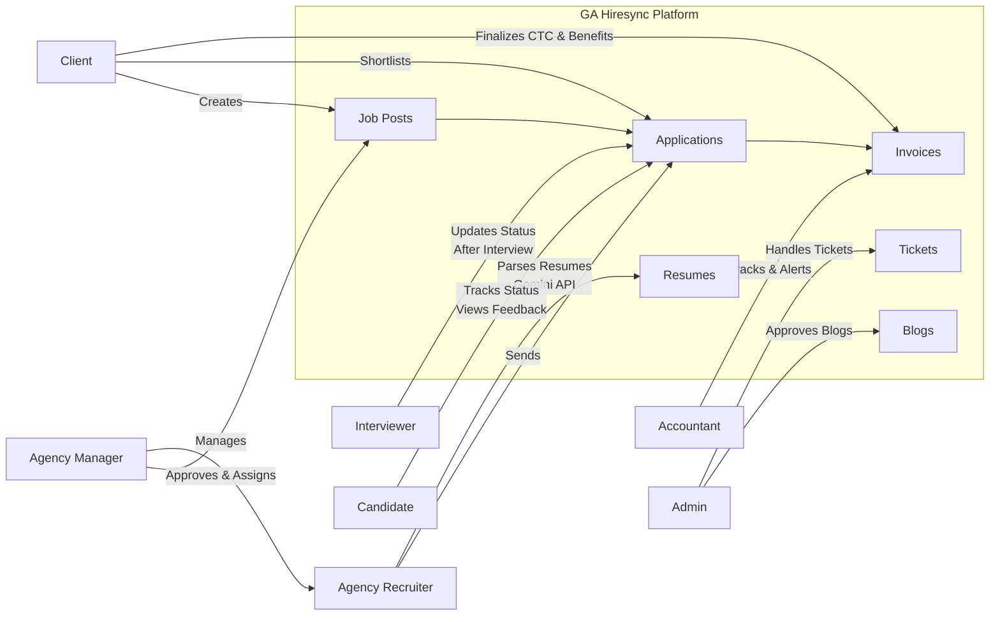

## GA Hiresync Roles and Responsibilities

### 1. Agency Manager
- **Purpose:** Primary target customer of GA Hiresync.
- **Responsibilities:**
  - Connect with clients regularly.
  - Approve job posts created by clients.
  - Assign approved job posts to recruiters.
  - Continuously track and manage recruiters' performance and progress.

### 2. Agency Recruiter
- **Purpose:** Handles the recruitment process for assigned job posts.
- **Responsibilities:**
  - View and manage assigned job posts.
  - Send resumes matching the job requirements.
  - Utilize **Gemini API Integration** for:
    - Parsing resumes.
    - Generating relevant resumes for job posts.
  - Interact with candidates and interviewers.
  - Schedule interviews and update statuses.
  - Track candidates until they successfully join the company.

### 3. Client
- **Purpose:** Customers of agencies who provide job openings.
- **Responsibilities:**
  - Connect to organizations via organization code.
  - Create job posts.
  - Review and shortlist applications sent by recruiters.
  - Act as the primary point of contact for agencies.
  - Finalize candidate selection, including **CTC** and additional benefits.

### 4. Interviewer
- **Purpose:** Conducts interviews for candidates.
- **Responsibilities:**
  - View upcoming interviews and assigned jobs.
  - Track interview statuses.
  - Update feedback and status after each interview.

### 5. Candidate
- **Purpose:** Job seekers interacting with recruiters and clients.
- **Responsibilities:**
  - Track status of their applications.
  - View feedback for each interview.
  - Monitor progress until final selection.

### 6. Accountant
- **Purpose:** Manages invoicing and payments.
- **Responsibilities:**
  - Track automatically generated invoices based on:
    - Accepted terms.
    - Candidate joining confirmations.
  - Alert clients for invoice payments.
  - Maintain historical invoice records.

### 7. Admin
- **Purpose:** Application-level administrator.
- **Responsibilities:**
  - Review and approve blog posts.
  - Handle tickets raised by users.

---

